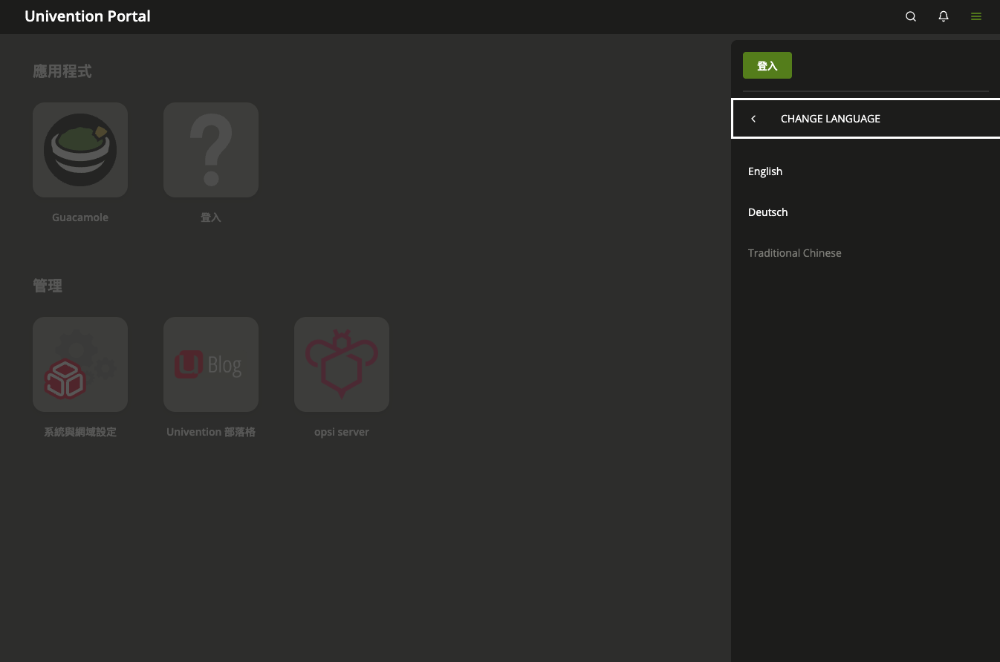
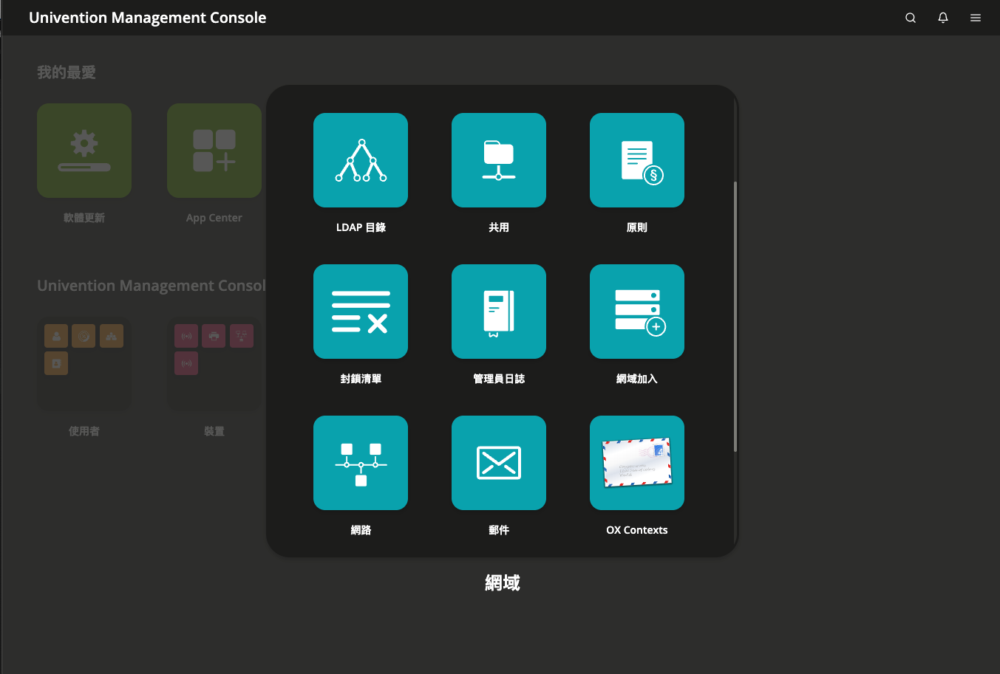
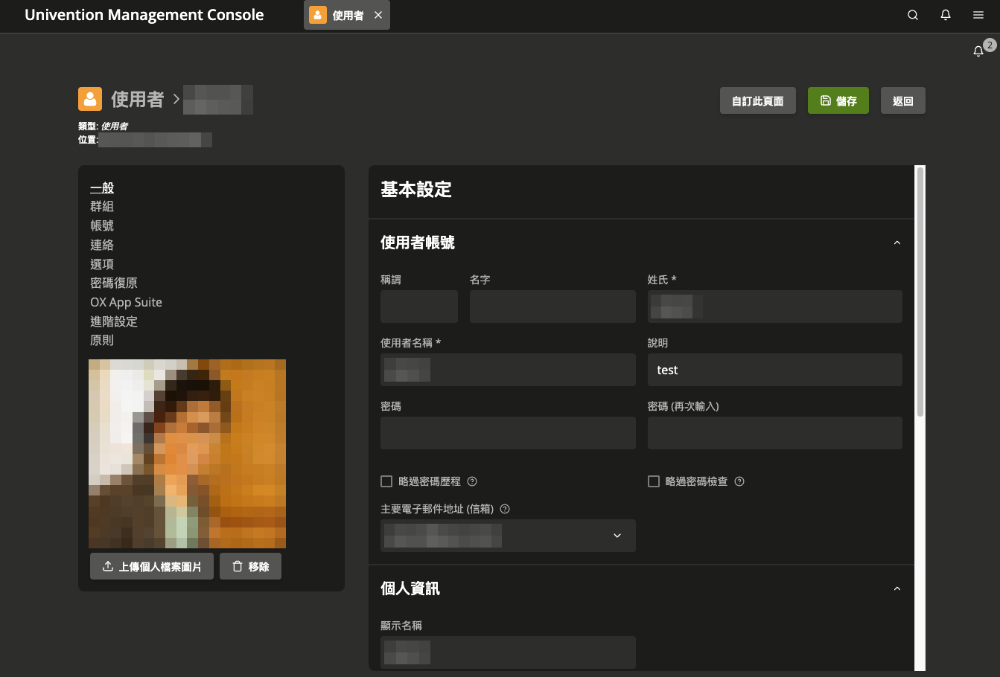

# jt-ucsi18n — UCS 繁體中文語言套件  `v1.1.0`

讓 [Univention Corporate Server (UCS)](https://www.univention.com/) 的登入頁、入口網站與管理主控台 (UMC) 顯示繁體中文 (zh_TW)。

> [English README](README.md)

## 實際畫面

於 UCS 5.2-3 擷取。

| | |
|---|---|
| **入口網站 — 語言選單中的「Traditional Chinese」** | **UMC 總覽 — 模組圖示** |
|  |  |
| **UMC — 使用者編輯頁面** | |
|  | |

## 安裝

在 UCS 主機上以 root 執行：

```bash
curl -fsSL https://raw.githubusercontent.com/jasoncheng7115/jt-ucsi18n/main/install.sh | bash
```

完成後在登入頁的語言選單選擇「Traditional Chinese」，並以 Ctrl+Shift+R 重新整理瀏覽器。
網域內每台 UCS 主機都要執行一次；入口網站項目名稱等 LDAP 資料只會在 Primary Directory Node 上寫入。

## 支援版本

| UCS 版本 | 套件 |
|---|---|
| 5.2-3 ~ 5.2-7 | `univention-l10n-zh-tw` 1.1.0-1 |

腳本會以 `ucr get version/version` 與 `version/patchlevel` 偵測版本，依 [`dist/versions.txt`](dist/versions.txt) 選出對應套件：

- 版本在支援範圍內：安裝對應套件。
- 同系列但比支援範圍新 (例如 5.2-8)：先安裝該系列最新套件並提示，新版才有的字串暫時顯示英文。
- 低於 5.2-3 或其他系列 (5.0、5.3)：停止並列出支援清單；加 `--force` 可強制安裝。

## UCS 升級之後

語言套件是獨立的 `.deb`，UCS 升級不會移除它。升級後執行下列指令取得對應新版的翻譯：

```bash
jt-ucsi18n update
```

## 其他指令

```bash
jt-ucsi18n status     # UCS 版本、已安裝套件、可用套件
jt-ucsi18n remove     # 移除語言套件與登入頁的繁體中文選項
jt-ucsi18n install --no-ldap   # 不寫入 LDAP 顯示名稱
```

## 它做了什麼

- 以 `dpkg -i` 安裝 `univention-l10n-zh-tw` (下載後驗證 SHA256)。套件只新增 zh_TW 的 `.mo` / `.json` 檔，不修改 UCS 既有檔案。
- 註冊 locale `zh_TW.UTF-8` 與 UCR 變數 `ucs/server/languages/zh_TW`。
- 重新啟動 UMC、Portal、Apache。
- 在 Primary 上為入口網站分類/項目與 UDM 擴充屬性加上 zh_TW 顯示名稱 (只新增，不覆蓋既有值)。

## 已知限制

- System Setup 的鍵盤型號/語言名稱清單顯示簡體，登入錯誤訊息結尾多一個 `.`，兩者皆為 UCS 上游問題。
- 翻譯涵蓋約 94% 字串；測試用目錄、URL 與廠商代碼刻意不翻。

## 與官方的關係

同一份翻譯已提交給 Univention：[Bug #59524](https://forge.univention.org/bugzilla/show_bug.cgi?id=59524)。
本專案是在官方合併之前的社群發佈版，並非 Univention 官方產品。

## 授權

依 UCS 相同條款 **GNU Affero General Public License v3.0** 釋出，見 [LICENSE](LICENSE)
與 `src/univention-l10n-zh-tw/debian/copyright`。

繁體中文翻譯與工具：Jason Cheng ([Jason Tools](https://jason.tools))。
原始英文字串與套件範本著作權屬 Univention GmbH。

版本紀錄見 [CHANGELOG_zh-tw.md](CHANGELOG_zh-tw.md)。
